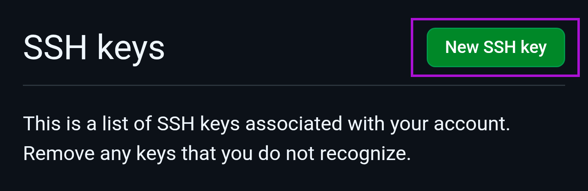

# Acode - Git/GitHub Setup

This was made because I prefer using the terminal for Git and didn't much care for the limited GitHub plugin for Acode. This gives you full command-line control of Git version control in Acode with GitHub.

All terminal commands are meant to be performed inside of Acode's terminal.

## Table of Contents
- [Install Dependencies](#install-dependencies)
- [Setup SSH Key](#setup-ssh-key)
	- [Generate SSH Key](#generate-ssh-key)
	- [Add New SSH Key Credentials Locally](#add-new-ssh-key-credentials-locally)
	- [Link SSH Key to GitHub](#link-ssh-key-to-github)
- [Odds \& Ends for Git Setup](#odds--ends-for-git-setup)
- [Issues](#issues)
- [Copyright](#copyright)

## Install Dependencies

Needed software to get everything running.

```bash
apk add git openssh-keygen openssh-client-common dropbear-ssh
```
- **git** - obvious; this is what we're setting up
- **openssh-keygen** - needed to generate an ssh key for authentication with GitHub
- **openssh-client-common/dropbear-ssh** - needed to connect to GitHub

## Setup SSH Key

This is needed to allow interaction between Git and GitHub via SSH such as cloning or pushing repos

### Generate SSH Key

First, setup and SSH key.

>[!NOTE]
> - Follow instructions after entering command 
> - For the location to save the key,leave blank
> - Passphrase highly suggested


```bash
ssh-keygen
```

Once complete, find your public key; we need it for the next step. The path to this will probably be `/root/.ssh/id_ed25519.pub` if you just followed the ssh-keygen output without changing anything. You can do the following command to output the key:
```bash
cat /root/.ssh/id_ed25519.pub
```

The output of that command will look like this:
```bash
ssh-ed25519 <random-string-of-characters> root@localhost
```
You'll need this key in a bit.

**Make sure to copy it all.**

> [!CAUTION]
> **Never** upload your private SSH key to a repository on accident or share it with anyone. It essentially acts as a login to your account.
> 
> If you do this, **immediately** revoke the key from your GitHub account.

### Add New SSH Key Credentials Locally

We need to add the SSH key's private key. This can be done either this way or the next.

> [!NOTE]
> This will need to be done every time the app restarts
> 
> Working on a way to not need to do this but the built in terminal doesn't seem to source .bashrc 

**Manual:**

```bash
# Start the agent and set environment variables
eval "$(ssh-agent -s)"

# Add your private key to the agent
# Default here should be correct path if other path was correct
ssh-add /root/.ssh/id_ed25519
```

**Automatically (Creates Scripts):**

```bash
cat << 'EOF' > /home/ssh-setup.sh
#!/bin/bash
# 1. Start agent socket variable
eval "$(ssh-agent -s)"

# 2. Add key from the root directory
ssh-add /root/.ssh/id_ed25519 2>/dev/null
EOF

chmod +x /home/ssh-setup.sh
/home/ssh-setup.sh
```

### Link SSH Key to GitHub

Below are the steps to add your newly created SSH key to your GitHub account. Photos are from Google Chrome on mobile, if you decide to do these steps on desktop for some reason then it will look different.

1. Open browser to https://github.com
	- If not already logged into GitHub, do so now
2. Click your profile icon in the top right of the webpage
    - 
3. Click "Settings" on the menu that pops down
    - 
4. Click "SSH & GPG keys" on this new menu
   - 
5. Scroll down until you see "New SSH key" in a green button and click it
	- 
6. Scroll down to enter title and key of the New SSH key that you previously made (`cat /root/.ssh/id_ed25519.pub` if you don't have it in your clipboard anymore)
	- For title, I usually go with `<username-on-computer>@<computer-name>`
	- Since Acode runs as sandboxed root in an app, I just put `acode@<phone-name>`
7. Once the title is in and the key is copied over, click the green "Add SSH key" button at the bottom of the page
	- 

## Odds & Ends for Git Setup

The following is to be done in Acode's terminal:

> [!IMPORTANT]
> Don't forget to change the values in angle brackets, <>, with the actual values that you want

- Change the default main branch name from master to main
  - `git config --global init.defaultBranch main`
- Set username to be used in commits
  - `git config --global user.name "<Your Name>"`
- Set email address to be used in commits
  - `git config --global user.email <your-email>`

All-in-one command if you prefer:
```bash
# Set your details here
git config --global init.defaultBranch main
git config --global user.name <Your Name>
git config --global user.email <Your Email>

# Verify the changes
# Don't change anything below here
echo "Default branch set to: $(git config --global init.defaultBranch)"
echo "Username set to: $(git config --global user.name)"
echo "Email set to: $(git config --global user.email)"
```

## Issues
If you run into any issues with setting this up, feel free to reach out and I'll try to help.

> [!NOTE]
> I am not affiliated with Git, GitHub, or Acode in any way.

## Copyright
Huh?..